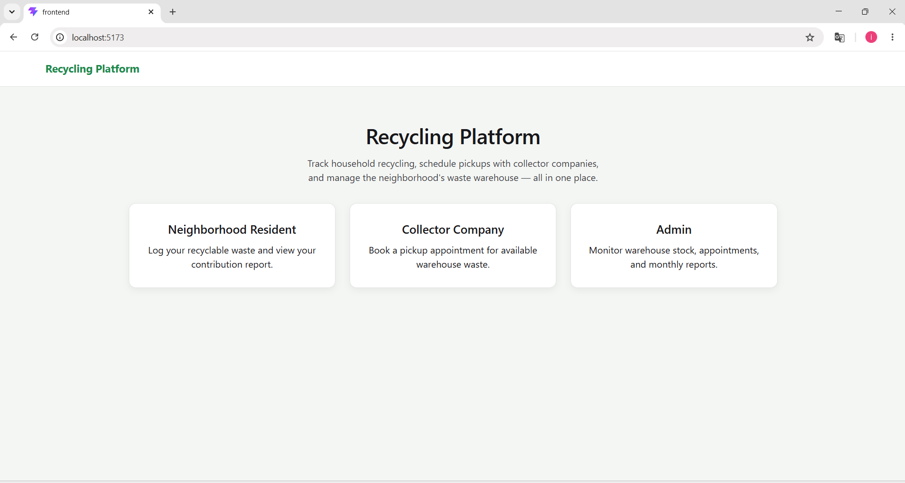
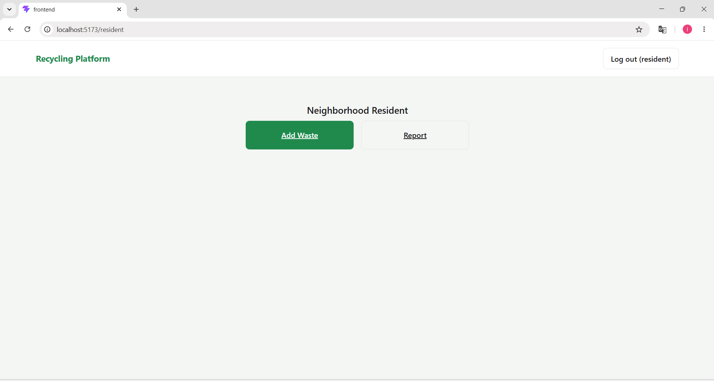
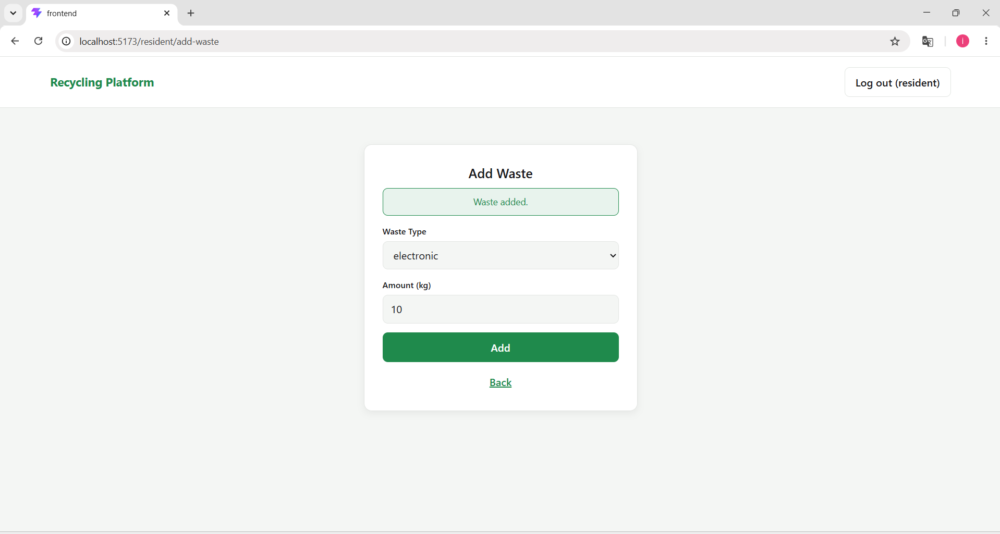
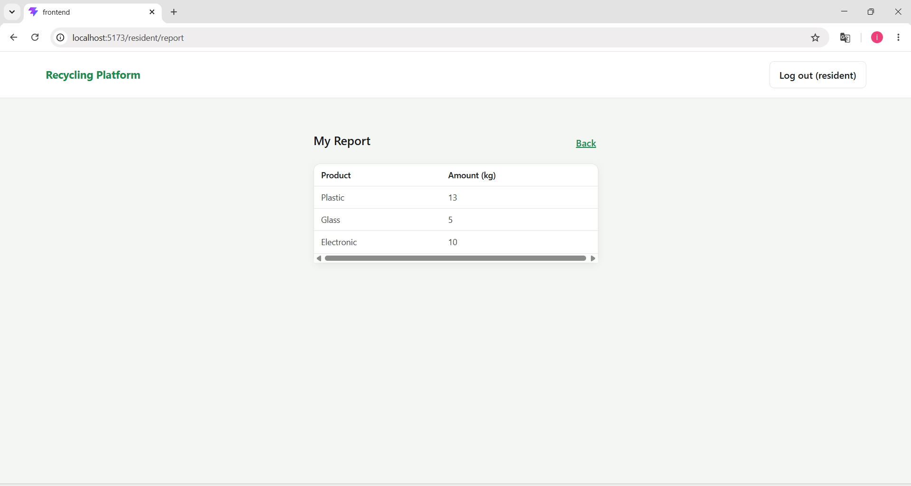
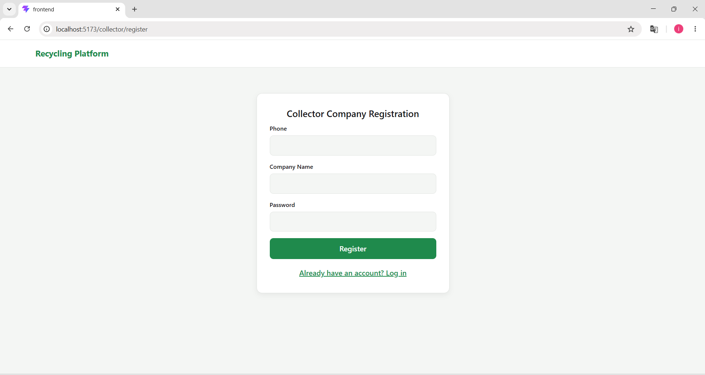
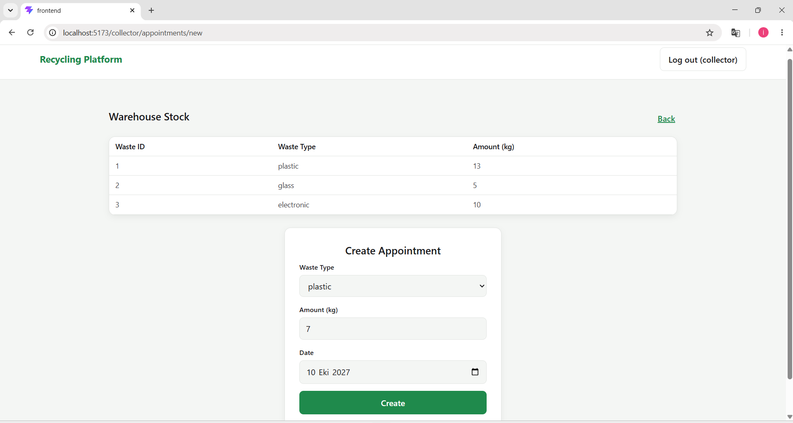
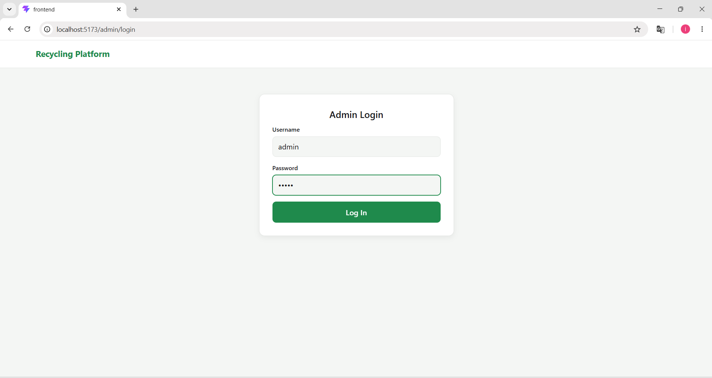
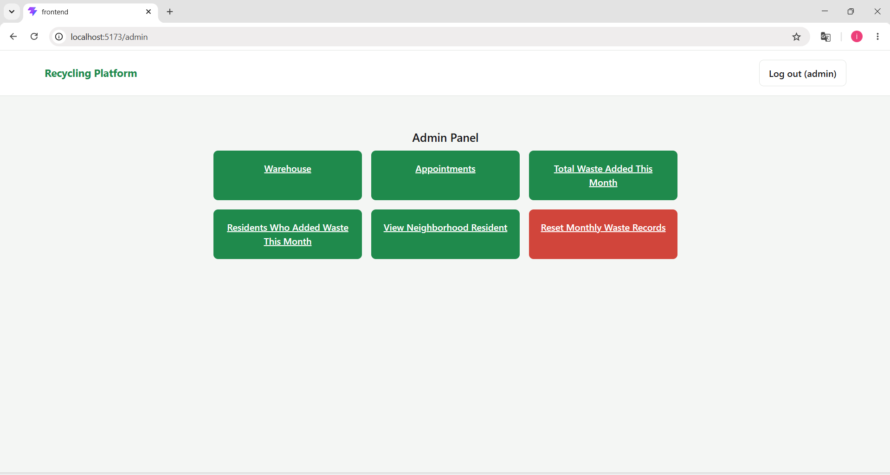
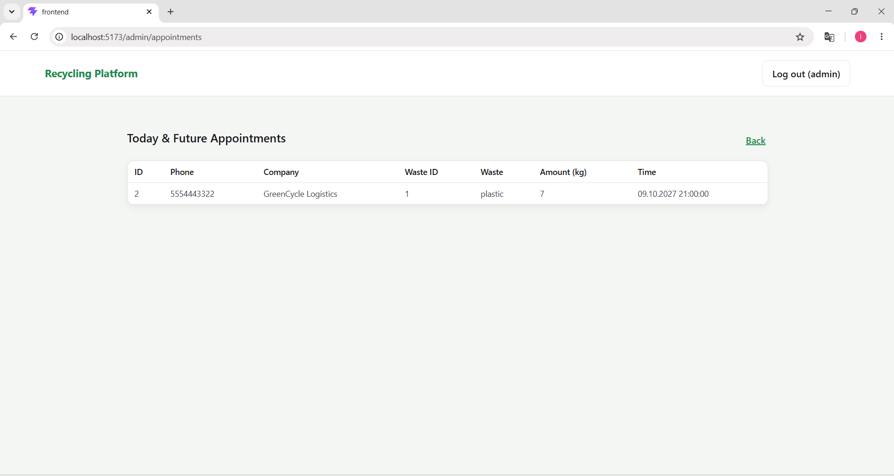

# ♻️ Recycling Platform


A full-stack recycling management platform. Residents log recyclable waste, collector companies book pickups, and admins monitor stock, appointments, and monthly reports — all backed by a PostgreSQL database where the business logic lives in PL/pgSQL functions and triggers.

---

## 📋 Features

### 🏠 Neighborhood Resident
- Register and log in with a phone number and password
- Log recyclable waste by type (plastic, glass, electronic)
- View a personal report of total contributions

### 🚛 Collector Company
- Register and log in
- View current warehouse stock in real time
- Book a pickup appointment for available waste

### 🛠️ Admin
- Log in with a fixed admin account
- View warehouse stock and today's/future appointments
- View monthly waste totals and top contributors
- Search residents by name and delete a resident
- Reset monthly waste records

---

## 🖥️ User Interface

### Home Page
The landing page — a role picker for Neighborhood Resident, Collector Company, and Admin. No login is required to reach this page.



---

### Neighborhood Resident

A resident registers with a phone number, name, surname, and password, then logs in to log waste and check their contribution report. The **login and registration screens have no screenshot below** — login asks for phone and password, and "Register" links to a form for phone, name, surname, and password; a successful registration redirects back to the login screen.

**Resident menu** — after logging in, the resident lands here with two actions: **Add Waste** and **Report**.



**Add Waste** — pick a waste type (plastic, glass, or electronic) and enter an amount in kg. Submitting calls `add_waste_for_neighborhood_resident`, which increases the resident's running total and triggers a warehouse stock update.



**My Report** — a read-only table showing the resident's total plastic, glass, and electronic contributions in kg, backed by `neighborhood_resident_report`.



---

### Collector Company

A collector company registers with a phone number, company name, and password, then logs in to check warehouse stock and book pickups. The **login screen has no screenshot below** — same pattern as the resident: phone and password to log in.

**Collector Company Registration** — phone, company name, and password. Submitting calls `register_collector_company`.



After login, the collector lands on a single-button menu (no screenshot) with **Create Appointment**, leading to the screen below.

**Create Appointment** combines two things: a live view of warehouse stock (waste ID, type, and available kg) and a form to book a pickup — choose a waste type, an amount, and a date. Submitting calls `create_appointment`, which validates that enough stock is available before creating the appointment; a successful booking reduces the warehouse total via a database trigger.



---

### Admin

The admin account is created by `database.sql` (username `admin`, password `admin`) — there is no admin registration screen.

**Admin Login** — username and password, checked against `admin_login`.



**Admin Panel** — six actions, each described below.



**Appointments** — a table of all pickup appointments scheduled for today or later (id, phone, company, waste type, amount, time), backed by the `todays_appointments` view.



The remaining four admin actions don't have a screenshot but work as follows:

- **Warehouse** — a table of current stock per waste type with the amount in kg, backed by `get_warehouse_records`.
- **Total Waste Added This Month** — three stat tiles summarizing total plastic, glass, and electronic kg logged by all residents this month, backed by `monthly_total_waste_report`.
- **Residents Who Added Waste This Month** — a table of residents (phone, name, surname) who logged at least one waste entry this month, backed by `neighborhood_residents_who_added_waste_this_month`.
- **View Neighborhood Resident** — a search-by-name box that looks up residents via `get_neighborhood_resident_by_name`; each result row has a **Delete** button that removes the resident (`delete_neighborhood_resident`) after a confirmation prompt.
- **Reset Monthly Waste Records** — a confirmation-gated action that zeroes out every resident's plastic/glass/electronic totals via `reset_monthly_waste`. Intended to be run at the start of each month.

---

## 🏗️ Project Structure

```
Recycling-Platform/
├── database.sql        # PostgreSQL schema, functions, triggers (source of truth for business logic)
├── backend/             # ASP.NET Core Web API (C#)
├── frontend/            # React + TypeScript (Vite)
└── images/               # Screenshots used in this README
```

---

## 🗄️ Database

All business logic — login checks, registration, waste totals, appointment creation, warehouse updates — lives in PostgreSQL, not in the backend. The backend only calls these functions and views; it never touches the schema directly.

**Tables:** `admins`, `neighborhood_residents`, `collector_companies`, `warehouse`, `appointments`

**Key functions & triggers:**
- Authentication: `neighborhood_resident_login`, `collector_company_login`, `admin_login`
- Registration: `register_neighborhood_resident`, `register_collector_company`
- Waste & reporting: `add_waste_for_neighborhood_resident`, `neighborhood_resident_report`, `monthly_total_waste_report`, `neighborhood_residents_who_added_waste_this_month`, `get_neighborhood_resident_by_name`, `delete_neighborhood_resident`, `reset_monthly_waste`
- Appointments & warehouse: `create_appointment`, `get_warehouse_records`, `todays_appointments` (view), plus triggers that update warehouse stock whenever waste is added or an appointment is booked

Full definitions are in [`database.sql`](database.sql).

---

## 🔌 API

Base URL:
```
http://localhost:5100/api
```

All routes except `/auth/*` require a `Bearer` JWT token obtained from a login endpoint, and are role-restricted (`resident`, `collector`, or `admin`).

| Method | Endpoint | Role | Description |
|---|---|---|---|
| POST | `/auth/resident/login` | — | Resident login |
| POST | `/auth/resident/register` | — | Resident registration |
| POST | `/auth/collector/login` | — | Collector company login |
| POST | `/auth/collector/register` | — | Collector company registration |
| POST | `/auth/admin/login` | — | Admin login |
| POST | `/resident/waste` | resident | Log a waste entry (type + amount) |
| GET | `/resident/report` | resident | Get the caller's waste report |
| GET | `/collector/warehouse` | collector | View current warehouse stock |
| POST | `/collector/appointments` | collector | Book a pickup appointment |
| GET | `/admin/warehouse` | admin | View current warehouse stock |
| GET | `/admin/appointments/today` | admin | View today's and future appointments |
| GET | `/admin/reports/monthly-waste` | admin | View this month's total waste by type |
| GET | `/admin/reports/contributors` | admin | View residents who added waste this month |
| GET | `/admin/residents?name=` | admin | Search residents by name |
| DELETE | `/admin/residents/{phone}` | admin | Delete a resident |
| POST | `/admin/reset-monthly-waste` | admin | Reset all residents' monthly totals to zero |

---

## ⚙️ Setup & Run

### Requirements

- [PostgreSQL](https://www.postgresql.org/download/) (16+ recommended), with a client such as pgAdmin
- [.NET SDK 10](https://dotnet.microsoft.com/download) or later
- [Node.js](https://nodejs.org/) 20+ and npm

### 1. Database setup

1. Create a database named `recycling_platform_db` (e.g. in pgAdmin: right-click **Databases** → **Create** → **Database...**).
2. Open `database.sql` and run it against the new database (in pgAdmin: select the database, open **Query Tool**, paste the contents of `database.sql`, and execute).

This creates all tables, functions, triggers, and a default admin account (`admin` / `admin`).

### 2. Backend setup (ASP.NET Core API)

```bash
cd backend
dotnet restore
```

Open `backend/appsettings.json` and check the connection string matches your local PostgreSQL setup:

```json
"ConnectionStrings": {
  "DefaultConnection": "Host=localhost;Port=5432;Database=recycling_platform_db;Username=postgres;Password=postgres"
}
```

Update `Username` / `Password` if your PostgreSQL credentials differ. Also review the `Jwt:Key` value — for a real deployment replace it with your own long random secret.

Run the API:

```bash
dotnet run --launch-profile http
```

The API starts on `http://localhost:5100`. Swagger/OpenAPI is available at `http://localhost:5100/openapi/v1.json` in development.

### 3. Frontend setup (React)

```bash
cd frontend
npm install
```

Check `frontend/.env` points to your running backend (default is already correct for local development):

```
VITE_API_BASE_URL=http://localhost:5100/api
```

Run the dev server:

```bash
npm run dev
```

The app opens on `http://localhost:5173`. The backend's CORS policy only allows this origin by default (see `Cors:AllowedOrigin` in `backend/appsettings.json`), so keep the frontend on port 5173 or update that setting to match.

### 4. Try it out

- Register a resident account, log in, add some waste, and check the report.
- Register a collector company, log in, and book a pickup appointment.
- Log in to the Admin Panel with `admin` / `admin` to see everything from the other side.

### Building for production

**Backend:**

```bash
cd backend
dotnet publish -c Release -o publish
```

**Frontend:**

```bash
cd frontend
npm run build
```

The production build is output to `frontend/dist/`. Update `VITE_API_BASE_URL` before building if the API will run on a different host.

---

## ⚠️ Notes

- Passwords are stored and checked as plain text in the database, matching the original schema in `database.sql`. This project does not implement password hashing.
- The backend never touches the database schema directly — it only calls the stored functions and views defined in `database.sql`.
