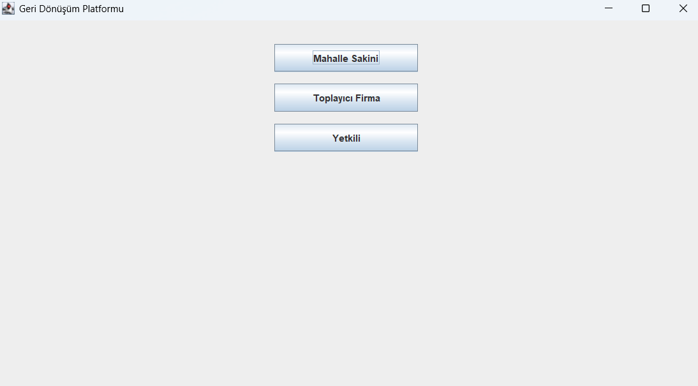
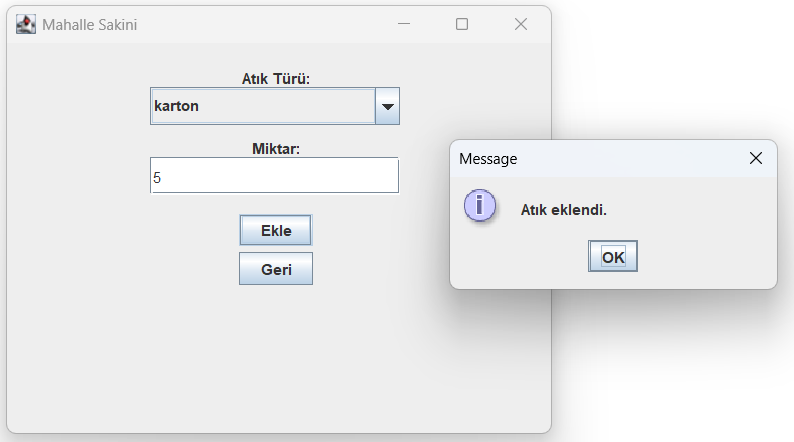
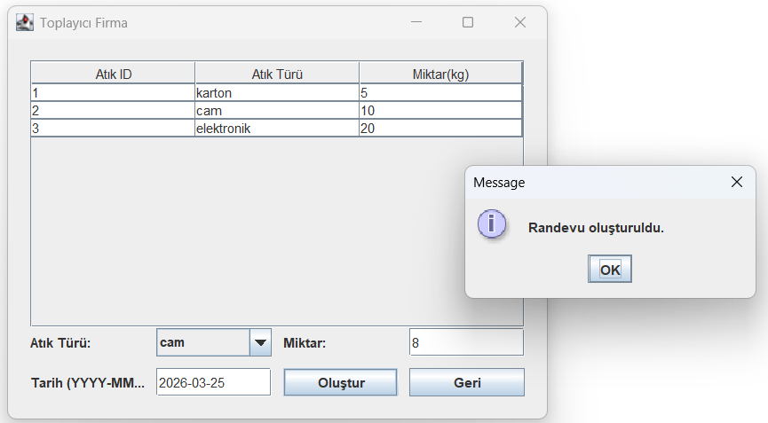
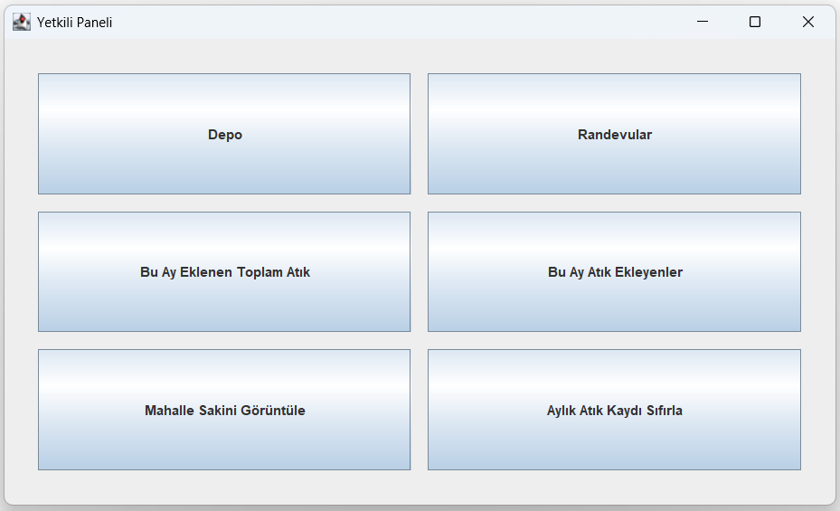
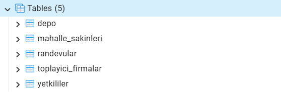
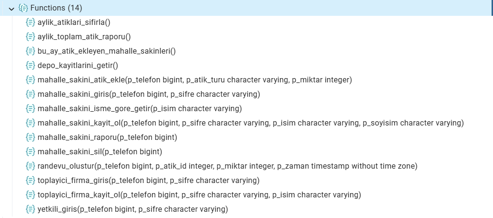

# ♻️ Recycling Platform

A desktop application developed using **Java (Swing)** and **PostgreSQL** for managing recycling processes.  
The system supports three different user roles: **Residents**, **Collector Companies**, and **Administrators**.

---

## 🚀 Features

### 👤 Resident
- Register and log in to the system
- Add recyclable waste (cardboard, glass, electronic)
- View personal waste reports

### 🚛 Collector Company
- Register and log in
- View available waste in the storage (depot)
- Create pickup appointments

### 🛠️ Administrator
- View depot status
- List appointments
- View monthly total waste statistics
- List residents who added waste
- Search and delete residents
- Reset monthly waste records

---

### 🔹 Main Menu
The main menu serves as the entry point of the system, allowing users to navigate to role-based authentication screens for Residents, Collector Companies, and Administrators.

---

### 🔹 Waste Addition (Resident)
Residents can select the waste type and enter the amount to add recyclable materials to the system. Once submitted, the data is stored in the database and automatically reflected in the depot via triggers.

---

### 🔹 Appointment Creation (Collector Company)
Collector companies can view the available waste in the depot and create pickup appointments by selecting the waste type, amount, and date. The system validates stock availability and updates the depot automatically after the appointment is created.

---

### 🔹 Admin Panel
The admin panel serves as the central control unit of the system, providing comprehensive management and monitoring capabilities. Administrators can view the current state of the depot, track and manage upcoming appointments, and access monthly waste statistics. In addition, the panel allows listing residents who have contributed waste, searching users by name, and removing them from the system if necessary. Administrative actions such as resetting monthly waste records are also supported. All operations are executed through database functions, ensuring data consistency and real-time updates across the system.

---

## 🗄️ Database Structure

### 📌 Tables
- `yetkililer` (admins)
- `mahalle_sakinleri` (residents)
- `toplayici_firmalar` (collector companies)
- `depo` (storage)
- `randevular` (appointments)

---

### ⚙️ Functions

The system heavily relies on PostgreSQL functions:

- Authentication functions  
- Registration functions  
- Waste insertion  
- Reporting  
- Appointment creation  
- Depot management (via triggers)  
- Admin operations  

---

## 🏗️ Project Structure

    recycling_platform/
    │
    ├── lib/
    │   └── postgresql-42.3.1.jar
    │
    ├── src/db/
    │   ├── AnaEkran.java
    │   ├── DBConnection.java
    │   ├── MahalleSakiniGirisEkrani.java
    │   ├── MahalleSakiniKayitEkrani.java
    │   ├── ToplayiciFirmaGirisEkrani.java
    │   ├── ToplayiciFirmaKayitEkrani.java
    │   ├── YetkiliGirisEkrani.java
    │
    ├── database.sql
    └── README.md

---

## ⚙️ Setup

1. Create a database using **pgAdmin**  
2. Run the `database.sql` file on your database  
3. Import the project into **Eclipse IDE**  
4. Update database credentials in `DBConnection.java`:

    private static final String URL = "jdbc:postgresql://localhost:5432/geri_donusum_platformu";
    private static final String USER = "postgres";
    private static final String PASSWORD = "your_password";

5. Run the project  

---

## 🔐 Admin Login

    Phone: 0
    Password: 0

---

## 🧠 Technical Details

- **Java Swing** → UI  
- **PostgreSQL** → Database  
- **JDBC** → Database connectivity  
- **PL/pgSQL** → Business logic (functions & triggers)  

### Trigger Logic
- When waste is added → depot is updated  
- When an appointment is created → depot stock decreases  

---

## 📌 Notes

- Core business logic is implemented in the database layer  
- Uses a **database-driven architecture**  
- PostgreSQL functions are central to the system  

---
